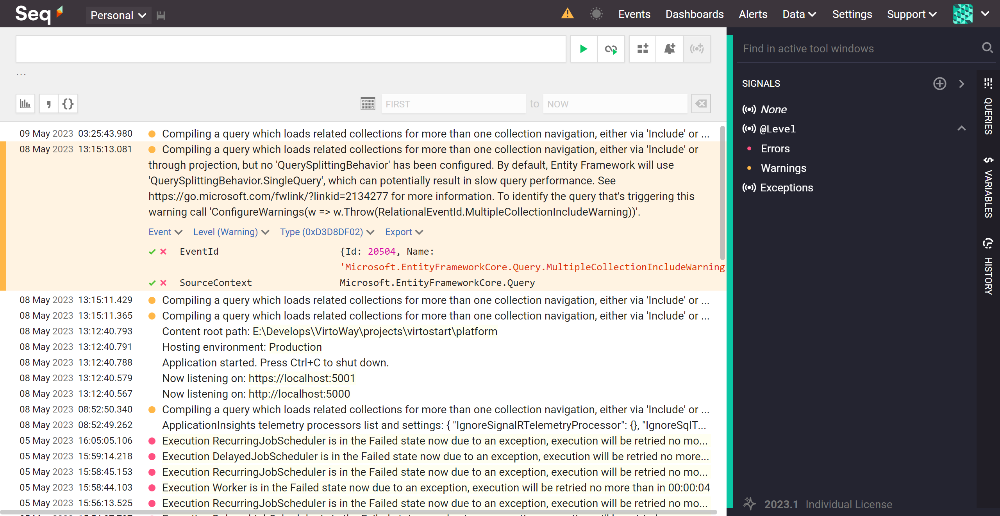

# Seq Log Module

## Overview

Seq log module collects application logging data in Seq.



## Configure Logging

The module comes with a [sink](https://github.com/datalust/serilog-sinks-seq) for Serilog that writes events to Seq. To enable logging update the following `Serilog` configuration sections:

```JSON
{
  "Serilog": {
    "Using": [
      ...
      "Serilog.Sinks.Seq"
    ],
    "WriteTo": [
      {
        "Name": "Seq", 
        "Args": {
          "apiKey": "[your api key]",
          "serverUrl": "http://localhost:5341"
        }
      }
    ],
    ...
  },
}
```

## References
* [Seq overview](https://docs.datalust.co/docs/an-overview-of-seq)
* [Serilog Library](https://serilog.net/)
* Deployment: https://docs.virtocommerce.org/developer-guide/deploy-module-from-source-code/
* Installation: https://docs.virtocommerce.org/user-guide/modules/
* Home: https://virtocommerce.com
* Community: https://www.virtocommerce.org
* [Download Latest Release](https://github.com/VirtoCommerce/vc-module-seq-log/releases/latest)

## License

Copyright (c) Virto Solutions LTD.  All rights reserved.

Licensed under the Virto Commerce Open Software License (the "License"); you
may not use this file except in compliance with the License. You may
obtain a copy of the License at

<http://virtocommerce.com/opensourcelicense>

Unless required by applicable law or agreed to in writing, software
distributed under the License is distributed on an "AS IS" BASIS,
WITHOUT WARRANTIES OR CONDITIONS OF ANY KIND, either express or
implied.